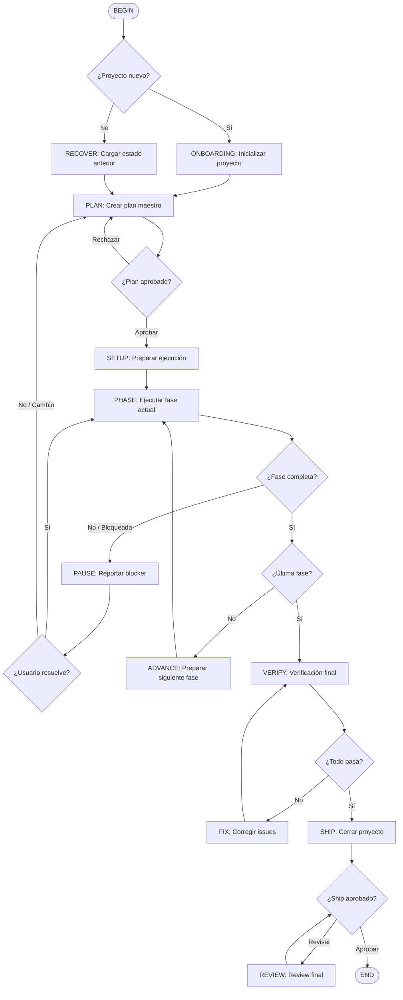

# Project Flow — Flujo Completo de Proyecto

Flujo end-to-end para proyectos de 100+ tareas. Encadena todo: onboarding, planificación, ejecución por fases, y cierre. Nunca pierde el foco del objetivo principal.

---

## Reglas Globales del Flujo

### 1. SCOPE LOCK (Inquebrantable)
- Durante la ejecución de CUALQUIER fase, si descubres un bug, mejora o refactor que NO está en el plan actual → NO lo toques
- Anótalo en `TODOS.md` bajo "Parking Lot"
- Continúa con la tarea actual
- ÚNICA excepción: Si el bug IMPIDE continuar la tarea actual, reporta y pide decisión

### 2. MEMORIA PERSISTENTE
- Leer `.kimi/memory/MEMORY.md` al inicio de cada fase
- Leer `.kimi/memory/PLAN.md` antes de cada tarea
- Actualizar `.kimi/memory/PROGRESS.md` después de cada fase
- Actualizar `TODOS.md` en tiempo real

### 3. DECISIONES DEL USUARIO
- Siempre presentar opciones estructuradas, nunca preguntas abiertas
- Cada decisión debe tener RECOMMENDATION clara
- Si el usuario no responde en 2 minutos en AFK mode, tomar la decisión recomendada

### 4. CHECKPOINTING
- Después de cada fase completada, hacer commit con mensaje descriptivo
- Guardar estado en `.kimi/memory/PROGRESS.md`
- Si hay error crítico, el flujo puede resumirse desde el último checkpoint
